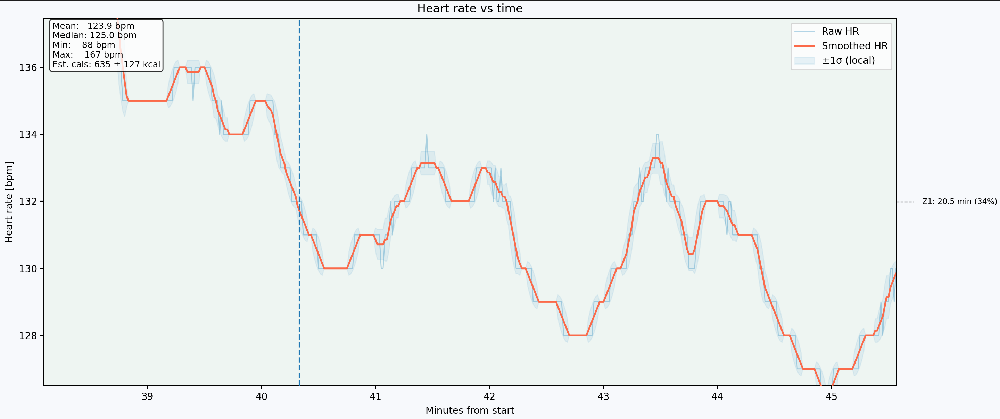
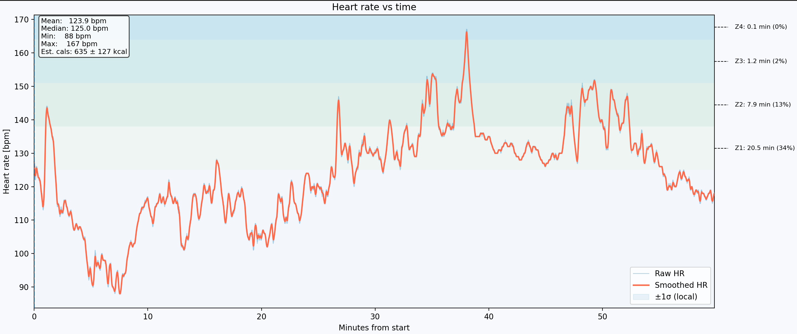
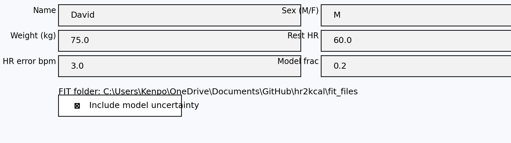

# hr-energy-lab

Interactive heart rate analysis for `.fit` files with error-aware calorie estimates.


This tool reads HR data from fitness devices, smooths noise, estimates calories with an explicit HR-to-kcal model, and propagates realistic HR uncertainty into a 1σ calorie error band.

---

## What it does

* Reads HR time series from `.fit` files (Garmin, Samsung, and similar)
* Smooths noisy HR with an automatically chosen moving window
* Estimates calories with a transparent, documented HR-to-kcal model
* Propagates HR noise and device error into a 1σ calorie uncertainty
* Computes time in HR zones and overlays zones on the plot
* Opens an interactive HR plot with zoom, hover, and a console summary
* Copies HR vs time to CSV (clipboard on Windows)

---

## Repository layout

```text
hr-energy-lab/
├── pyproject.toml            # Packaging metadata
├── requirements.txt          # Runtime dependencies
├── README.md                 # This document
├── LICENSE                   # MIT License
├── run.bat                   # Windows helper to launch the tool
├── fit_files/                # Default .fit directory with a sample file
├── examples/
│   └── profile.example.yaml  # Example profile configuration
└── src/hr_energy_lab/
    ├── __init__.py
    └── hr_interactive.py     # Main CLI / plotting entry point
```

If you install the project with

```bash
pip install -e .
```

you also get a console command called `hr-energy-lab` that launches the interactive tool.

---

## Core features

### Input and preprocessing

* Loads `.fit` files with `fitparse` and extracts timestamps and heart rate.
* Converts timestamps to minutes from start:
  \[
  t_i = rac{t_i - t_0}{60\ 	ext{s}}
  \]
* Currently only `.fit` is supported. TCX, GPX, CSV, or API inputs would need extra parsers.

### HR smoothing and local noise estimate

Function: `compute_smoothed_auto(minutes, hr_vals, target_durations_min=None)`

* Evaluates several candidate window durations (default 0.1 to 2.0 min).
* For each window size, uses leave-one-out cross validation to minimize mean squared error between each point and the mean of its neighbors.
* Returns:
  * smoothed HR series
  * local per-sample standard deviation (HR noise estimate)
  * chosen window size
  * effective smoothing duration in minutes

This gives a data-driven smoothing choice plus a local HR noise estimate for uncertainty propagation.

### HR zones

Zones are constructed in `build_zones_from_config(zones_cfg, hr_rest, hr_max)`.

zone axis alongside the primary stats box.

A zoomed view shows the colored zone shading and hover tooltips for precise inspection.

Add a screenshot similar to:

```markdown

```

Annotate in the image (not in the README) the main elements:

* raw HR trace
* smoothed HR trace
* 1σ uncertainty band
* colored zone background
* primary stats box
* right hand zone axis

### In plot profile tweaks

A profile panel below the plot mirrors key `profile.yaml` fields:

* name
* sex, age, weight (kg)
* rest and max HR
* device HR error floor
* model fraction and uncertainty toggle

You can modify values and click **Apply changes** to recompute calories, zones, and stats in place. **Reset** restores values from `profile.yaml` for the current run. Edits affect only the live session.

**Figure 2 placeholder: profile panel and live edits**

Add a cropped screenshot similar to:

```markdown

```

The figure should visually label:

* editable fields (age, weight, hr_rest, hr_max, hr_error_bpm)
* any model options or toggles
* Apply and Reset buttons
* how changes update the plot and calorie summary

### CSV export

`copy_csv_to_clipboard(minutes, hr_vals)` builds a CSV with headers and either:

* copies it to the clipboard on Windows, or  
* prints a short notice elsewhere.

---

## Installation

Requirements:

* Python 3.9 or newer
* `numpy`
* `matplotlib`
* `fitparse`
* `pyyaml`

Install in a fresh virtual environment for development:

```bash
python -m venv .venv
source .venv/bin/activate          # on Windows: .venv\Scriptsctivate
pip install -e .
```

Or install only the dependencies:

```bash
pip install -r requirements.txt
```

---

## Quick start

1. Place your `.fit` files in `fit_files/` (shipped default) or another folder.
2. Copy `examples/profile.example.yaml` to `profile.yaml` and edit with your details.
3. Run one of:

   ```bash
   python -m hr_energy_lab.hr_interactive
   # after editable install
   hr-energy-lab
   # on Windows with the helper
   run.bat
   ```
4. When prompted, choose the folder containing your `.fit` files. The tool:
   * lists the newest files,
   * parses HR vs time,
   * selects a smoothing window,
   * computes HR metrics and calories with uncertainty,
   * copies CSV to clipboard on Windows, and
   * opens the interactive plot.
5. Use the profile panel to adjust weight, rest and max HR, device HR error, and model settings for quick what if checks. Use **Reset** to return to the YAML configuration.

### Sample `.fit` file

A demo activity (`sample.fit`) from the `fitparse` test suite is included in `fit_files/`. This is the default initial folder so you can open a plot immediately before pointing the tool at your own data.

---

## `profile.yaml` format

Example:

```yaml
name: David
sex: M            # "M" or "F"
age: 32
weight: 86.0      # in kg unless weight_unit: lb
weight_unit: kg   # "kg" or "lb"
height_cm: 188    # optional

hr_rest: 55       # optional but needed for HRR zones
hr_max: 190       # optional but needed for HRR zones

# Device floor for 1 sigma HR error in bpm
# 3 bpm is a reasonable default for Galaxy Watch 4 class devices
hr_error_bpm: 3.0

# Optional custom zones
zones:
  - name: Z1
    low_pct: 0.50
    high_pct: 0.60
  - name: Z2
    low_pct: 0.60
    high_pct: 0.70
  - name: Z3
    low_pct: 0.70
    high_pct: 0.80
  - name: Z4
    low_pct: 0.80
    high_pct: 0.90
  - name: Z5
    low_pct: 0.90
    high_pct: 1.00
```

If `profile.yaml` is missing or invalid, the script falls back to a simple interactive prompt and uses a generic profile with no zones.

---

## Scope

This project is intended as:

* a clear, inspectable implementation of HR based energy estimation,
* a tool that makes HR noise and calorie uncertainty explicit, and
* a starting point for personal analysis or research.

It is not intended to:

* replace medical grade calorimetry,
* guarantee absolute calorie accuracy for weight management, or
* provide full training load management on its own.

---

## Possible extensions

Potential extensions include:

* Support for additional input formats (`.tcx`, `.csv`, device exports)
* An explicit model error term, combined in quadrature with HR noise
* A small CLI to write HTML reports with plots and summary tables
* Calibration tools that fit a simple scale factor to a trusted reference

---

## License

MIT - see [LICENSE](LICENSE).
